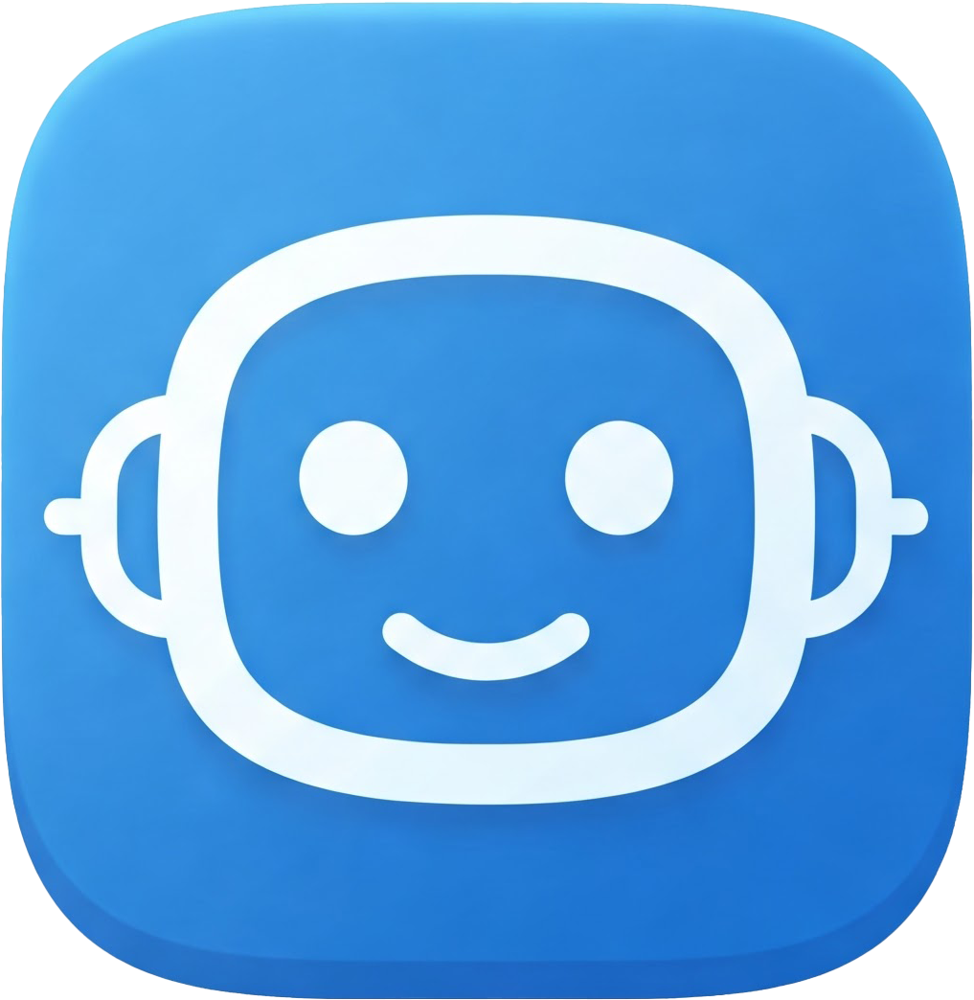

# Clueme

<div align="center">
  


</div>

------
[](https://github.com/Creative-Geek/Clueme/actions/workflows/release.yml)

A Windows application that provides AI assistance through keyboard shortcuts, designed to be invisible to screen recording software.

## Features

- Screen OCR using Gemini Vision (because tesseract and EasyOCR are not good enough)
- **NEW: Coding Mode** - Direct coding question assistance using OneOCR (Windows native OCR)
- AI integration with OpenAI (or the many free compatible endpoints)
- Global keyboard shortcuts
- Stealth mode (invisible to screen recording)
- Modular architecture with separate AI processing component
- Markdown rendering with syntax-highlighted code blocks (in coding mode)
- Could work on macOS but you'll need to edit some lines (MCQ mode only)
-----

⚠️⚠️⚠️ Danger: this program is for research purposes only!

It was made as a response to the following post on X:
<div align="center">

</div>
As apparantly on whatever planet they live, everyone makes $7000+ a month.

Still, Do NOT missuse it, I'm not responsible for your or anyone else's use of this program.

## Modes

### MCQ Mode (Original)
Run `clueme.py` for multiple-choice question assistance using Gemini Vision for OCR.

### Coding Mode (NEW)
Run `clueme_coding.py` for coding question/assignment assistance using OneOCR (Windows native OCR).
- Provides markdown-formatted responses with syntax-highlighted code blocks
- Designed for coding assessments and programming assignments
- Uses OneOCR for faster, offline-capable text extraction

## Setup

### Basic Setup (MCQ Mode)

1. Install Python 3.8 or higher
2. Install dependencies:
   ```
   uv pip install -r requirements.txt
   ```
3. Create a `.env` file with your configuration (please do not include any comments in the file):
   ```
   # Solving Model Configuration
   SOLVING_MODEL_API_KEY=your_api_key_here
   SOLVING_MODEL_BASE_URL=your_custom_endpoint_url
   SOLVING_MODEL=your_model_name

   # OCR Model Configuration (for MCQ mode)
   OCR_API_KEY=your_ocr_api_key_here
   OCR_BASE_URL=your_ocr_endpoint_url
   OCR_MODEL=your_ocr_model_name

   # Hotkey Configuration
   CAPTURE_HOTKEY=Alt+Enter
   QUIT_HOTKEY=Ctrl+Alt+Q
   RESET_HOTKEY=Ctrl+Alt+R
   ```

### OneOCR Setup (for Coding Mode)

⚠️ **Important**: OneOCR requires specific DLL files that must be manually installed.

1. Create the OneOCR config directory:
   ```
   mkdir %USERPROFILE%\.config\oneocr
   ```

2. Download and place the following files in `C:\Users\<YourUsername>\.config\oneocr\`:
   - `oneocr.dll` - OneOCR library
   - `oneocr.onemodel` - OCR model file  
   - `onnxruntime.dll` - ONNX Runtime library

3. These files can be obtained from the [OneOCR releases](https://github.com/AuroraWright/oneocr)

The application will warn you if these files are missing when you try to run coding mode.

## Usage

- Press the configured capture hotkey (default: `Alt+Enter`) to capture screen and get AI assistance
- Press the configured quit hotkey (default: `Ctrl+Alt+Q`) to close the application
- Press the configured reset hotkey (default: `Ctrl+Alt+R`) to reset the application state

## Hotkey Configuration

You can configure the hotkeys in the `.env` file using the following format:

- Modifiers: `Ctrl`, `Alt`, `Win`, `Shift`
- Keys: Any single key (e.g., `R`, `Q`, `Enter`)
- Format: `Modifier1+Modifier2+Key` (e.g., `Ctrl+Alt+R`, `Alt+Enter`)

## PyInstaller Compilation Command

```bash
pyinstaller --onefile --noconsole --icon=clueme.ico --name=clueme --add-data ".env;." --exclude-module PyQt5 --exclude-module PyQt6 clueme.py
```

## Architecture

The application is built with a modular architecture:

### MCQ Mode (clueme.py)
- `clueme.py`: Main application file handling UI and hotkey management
- `ai_processor.py`: Dedicated module for AI processing and OpenAI integration
- `ocr.py`: OCR functionality using Gemini Vision

### Coding Mode (clueme_coding.py)
- `clueme_coding.py`: Main application for coding questions with markdown rendering
- `coding_ai_processor.py`: AI processor optimized for coding questions
- `oneocr_wrapper.py`: Wrapper for OneOCR (Windows native OCR)

# Notes:
## Can work offline:
If you have ollama with a vision model you can specify it to be the endpoint for both OCR and Solving models (specify the models too).

## ~~Requires Windows 10 version 2004 or higher~~(fixed):
~~I only tested it on Windows 11 24H2 but the flag for screen capture exclusion might not work on older versions.~~


Testing on windows 10 build 19045 revealed that it doesn't work unless the window isn't frameless, which was implemented as a dynamic check during runtime.

## Make the AI hear:
You can intergrate whisper, adding the generated STT as context for each message, but it's not implemented, you're welcome to put in a pr.
